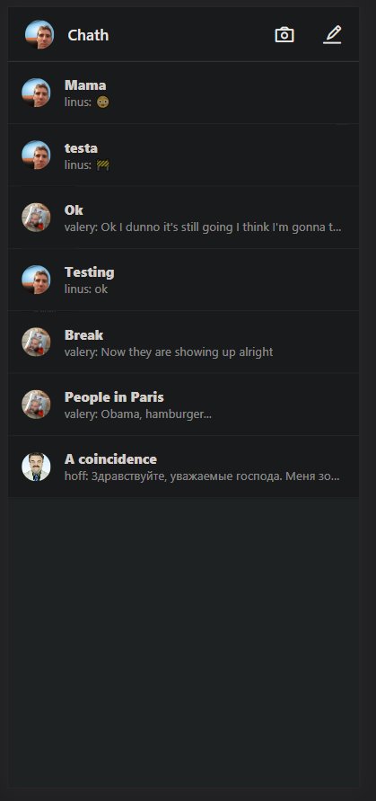
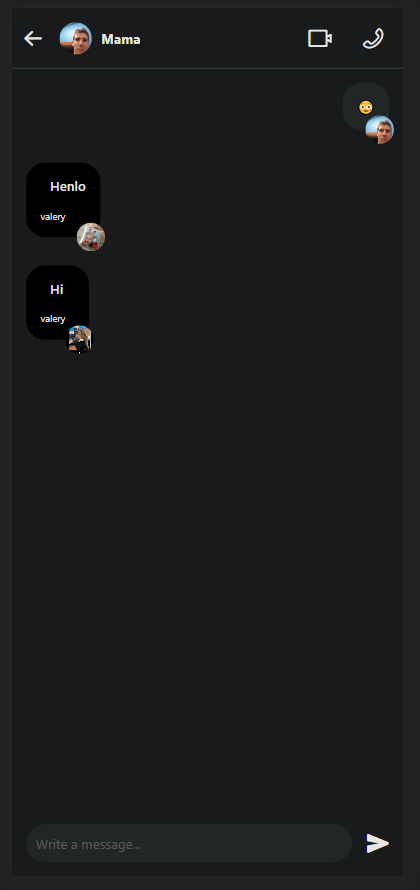
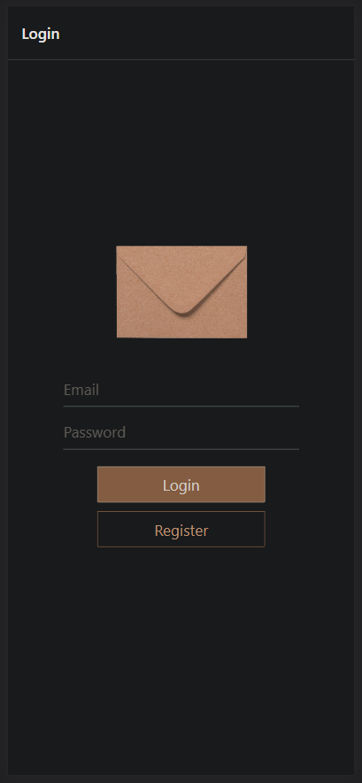
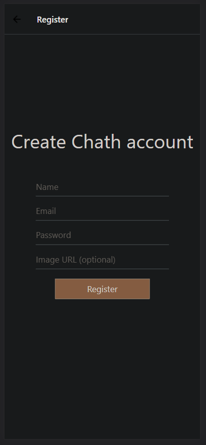

	<h1><a href="https://chath-v-v.web.app/">Chath</a></h1>
  
<h2>Information</h2>

Chath is a simple cross-platform messaging app.

<h2>Screenshots</h2>
  
  
  
  
  
 

## Tech Stack

-   [React](https://reactjs.org/)
-   [React Native](https://reactnative.dev/)
-   [React Navigation](https://reactnavigation.org/)
-   [Expo](https://expo.dev/)
-   [Firebase](https://firebase.google.com/)

[💬](https://chath-v-v.web.app)
